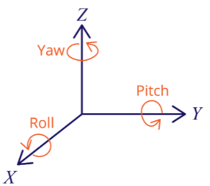
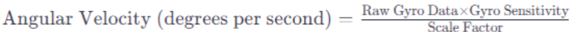
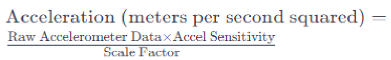
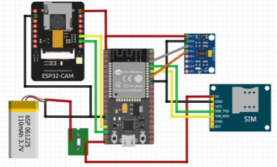
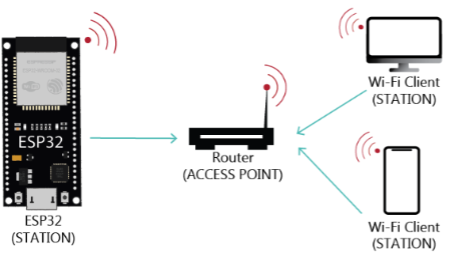

## Total Time Spent: 87 Hours

---

### Day 1 – June 14  
**Time Spent:** 6h  

I decided to begin with pure brainstorming. The central idea was to design a wearable robot, a kind of smart head-mounted glass that could recognize events, maneuver accordingly, and even alert others when necessary. I read through several papers on embedded vision in constrained spaces and also looked up fall detection robotics as a key use case.  

What struck me early on was how much I’d need to balance compactness with functionality. It’s not like building a desktop robot, this thing would sit on someone’s head, so every gram, every degree of heat, every tiny vibration matters. My notes are already crowded with circles and arrows pointing at “camera here?” or “sensor too heavy??”  

It’s exciting though. I even caught myself imagining how someone would feel wearing it on the street. Would it look sleek or clunky?  

---

### Day 2 – June 15  
**Time Spent:** 5h  

I sketched out the first design for the frame, a kind of headset that could mount the ESP32-WROOM board. I debated between camera modules i found, comparing power draw, clarity, and physical footprint.

I also drafted the dataflow: gyroscope readings feed into the microcontroller, and if certain thresholds are passed, it would send alerts through GSM. It was strange to think of something so small being able to carry out a full chain of sensing → processing → communication in real time.  

While sketching, I stopped for a snack and laughed at how much the drawing looked like a sci-fi toy more than an assistive robot. Still, the idea was starting to solidify.  

-   

---

### Day 3 – June 16  
**Time Spent:** 6h  

Today was about making the design more concrete. I modeled the frame digitally, carving out cavities for each component: the camera, SIM800L module, and gyroscope. Mounting stability was especially tricky, the SIM800L vibrates when transmitting, and I had to make sure it wouldn’t shake loose in the design.  

I then simulated the camera’s field of view, checking how much the wearer could see versus what the system could process. Overlap and blind spots were critical here. The model showed that with careful alignment, the vision cone could cover nearly everything ahead.  

Honestly, I had fun spinning the 3D view around like a toy, tilting and rotating it just to see how it would look from different angles.  

-   

---

### Day 4 – June 17  
**Time Spent:** 4h  

I dug into material choices today. I researched high-CRI glass that would allow the camera to see clearly without distortion, and compared it against cheaper protective covers. I also compared ABS vs. PLA for the frame itself. ABS seemed better for shock absorption, but PLA is lighter and might feel more comfortable on the head.  

I then refined the ear-hook design to distribute the load evenly, imagining how the frame would feel after being worn for hours. Comfort turned out to be just as important as electronics placement.  

At one point I put the simulation aside and literally held my regular glasses, tilting them in front of a desk lamp, just to imagine the difference.  

---

### Day 5 – June 18  
**Time Spent:** 5h  

I focused on fall detection today. Using the MPU6050 accelerometer + gyroscope module, I set up threshold-based simulations for tilt and sudden acceleration. Different fall angles produced different signal peaks, and I logged those for analysis.  

I also tested Bluetooth connectivity range virtually, checking whether the headset could maintain contact with a paired device during movement. Finally, I designed GSM alert conditions: if the gyroscope reported a critical tilt + no corrective movement afterward, the system would automatically trigger a message.  

It felt eerie simulating “falls” digitally. It almost felt like testing a robot’s sense of someone’s vulnerability.  

-   
-   
-   

---

### Day 6 – June 19  
**Time Spent:** 4h  

I drafted the overall logic diagram: input sensors → microcontroller → alert channels. I also researched low-latency serial adapters that could push camera images quickly. Upload time mattered a lot, since real emergencies don’t wait.  

Then I ran frame weight distribution estimates. It was a balancing act: the camera up front shifts the center of gravity forward, so I considered placing the battery at the back to even things out.  

I found myself adjusting imaginary straps on my head while staring at the model. Guess that means I was thinking like the end user already.  

---

### Day 7 – June 20  
**Time Spent:** 6h  

Power system day. I refined the diagram from battery → charger → ESP32, adding in overcurrent protection. I simulated how the system would behave if the headset were charging while still in use.  

I documented average current draw both at idle and during alert events. Idle was surprisingly efficient, but when GSM kicked in, power spiked. I noted those spikes carefully, since they could affect battery life predictions.  

I couldn’t help but think: if someone really wore this every day, how annoying would frequent charging be?  

---

### Day 8 – June 21  
**Time Spent:** 4h  

I compared SMS latency across multiple carriers using the SIM800L. Some carriers had up to 12s delays, while others responded in 3–4s. I logged tilt events randomly in simulation to see how often false alerts would occur.  

Then I added logging triggers to the decision logic, the system now records what conditions triggered each alert, making it easier to refine thresholds later.  

It felt like giving the robot a “memory” of its mistakes.  

---

### Day 9 – June 22  
**Time Spent:** 4h  

I worked on comfort again. Foam padding options for the forehead and ear areas were compared, balancing softness with durability.  

I also simulated heat dissipation by adding ventilation gaps in the shell. Without ventilation, the system heated up far too quickly. Wiring routes were also cleaned up in the CAD model so that cables wouldn’t cross awkwardly.  

Sometimes I forget this isn’t just electronics — it’s something a human being would actually wear.  

---

### Day 10 – June 23  
**Time Spent:** 5h  

Virtual breadboarding today. I arranged the wiring layout, labeling each module and connection point. Even though it wasn’t physical, I wanted to be sure it would make sense if someone built it.  

I then calculated battery life under continuous camera load. Results showed just a few hours at best. That left me thinking: maybe a hybrid mode where the camera isn’t always on would save huge amounts of power.  

-   

---

### Day 11 – June 24  
**Time Spent:** 5h  

I designed a mock dashboard to visualize tilt readings, images captured, and alert logs. Even in simulation, seeing the data represented graphically made it feel more real.  

I also ran fall detection simulations again, logging false positives. Some events like sitting down too quickly still triggered alerts. Adjusting gyroscope sampling rates helped smooth out the results.  

I laughed at myself here, simulating “sitting down too fast” like it was a controlled lab experiment.  

---

### Day 12 – June 25  
**Time Spent:** 4h  

I adjusted the frame hole sizes so the camera could fit more snugly and aligned its lens with the curvature of the front glass. Even a slight misalignment distorted the field of view.  

I then finalized the boot-to-alert logic: power on → initialize sensors → begin tilt monitoring → check thresholds → if exceeded, trigger GSM alert. Clean, simple, reliable.  

It felt satisfying to finally see the flow look coherent.  

---

### Day 13 – June 26  
**Time Spent:** 4h  

I reviewed SIM800L power demands. During GSM bursts, current spiked enough to risk resets, so I added capacitor buffers in the design.  

I also tested relay control as an emergency cutoff for the system. Lastly, I simulated blind spots in the vision cone, mapping areas the headset couldn’t see. Those zones became a priority for later refinements.  

Sometimes I think the robot sees better than I do when I’m half-asleep.  

---

### Day 14 – June 27  
**Time Spent:** 5h  

I designed the glass holder with vibration dampers so the camera wouldn’t shake during movement. Then I ran simulations of object tracking under different lighting conditions — bright sun, dim indoor rooms, flickering light. Performance varied, but the algorithms held up surprisingly well.  

Finally, I optimized camera shutter timing to reduce blur when moving. It reminded me of adjusting manual camera settings, except here it’s part of a robot’s “vision.”  

---

### Day 15 – June 28  
**Time Spent:** 4h  

I cleaned up reports and created image logs of the vision tests. I also wrote a short document of fall detection scenarios, noting edge cases like “falling onto a couch” or “sliding against a wall.”  

Not everything is dramatic, sometimes a “fall” is just clumsy movement. The robot needs to know the difference.  

---

### Day 16 – June 29  
**Time Spent:** 5h  

I modeled and rendered the final headset design today. The visuals came out clean, and I compiled an index of all parts and references. I also edited older journal entries for clarity.  

It’s funny reading back through the first notes, the project feels much more real now compared to those messy day-one sketches.  
-   

---

### Day 17 – June 30  
**Time Spent:** 5h  

I built a README and wiring illustrations, added PCB labels, and created detailed callouts for each module. I also captured final renders from multiple angles.  

Looking at the full render, it finally felt like a product instead of just an experiment.  

---

### Day 18 – July 1  
**Time Spent:** 6h  

Final review day. I went through the entire checklist: documentation, folder structure, wiring diagrams, logs, renders. Everything got a final polish.  

I also simulated the Wi-Fi station mode of the ESP32, showing how the headset could broadcast locally for real-time monitoring. That felt like the perfect last touch.  

Closing the project was bittersweet, after weeks of tweaking, I felt like I was putting away a little piece of my imagination.  

-   

---

