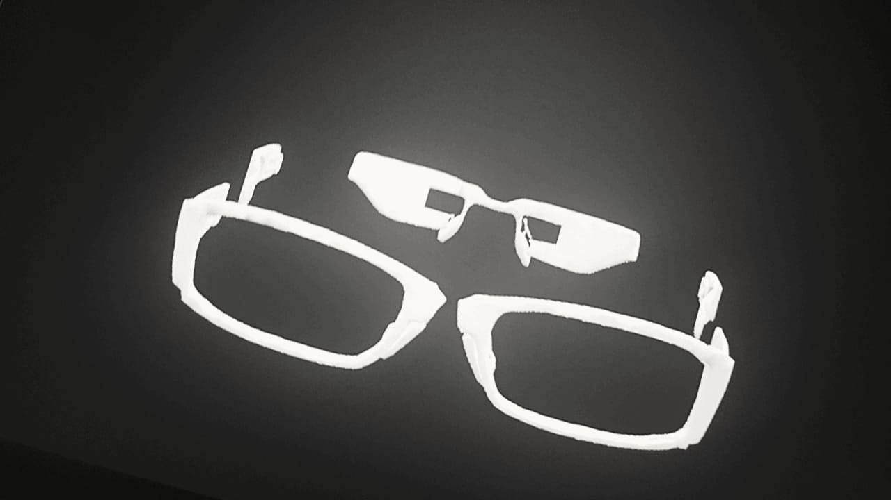
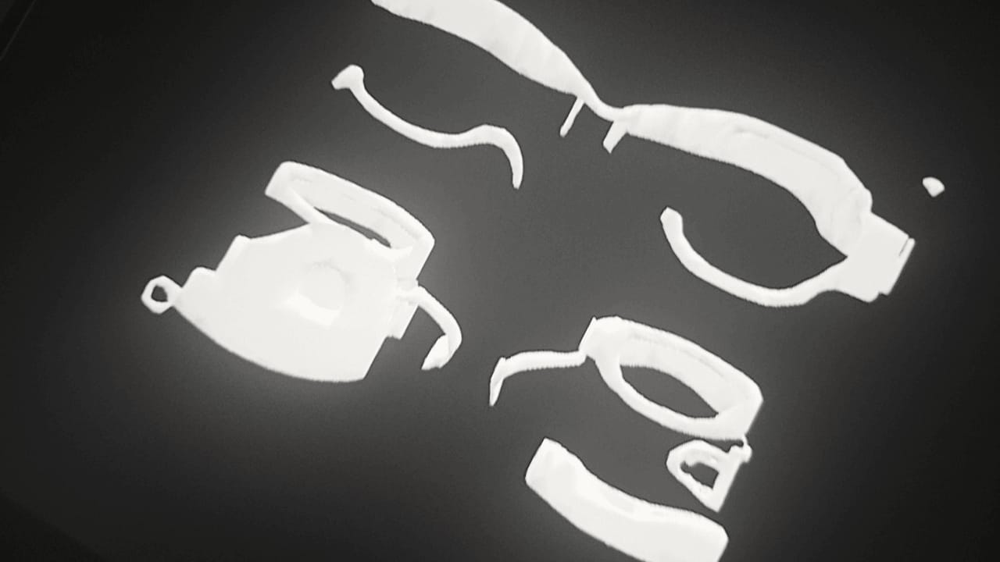
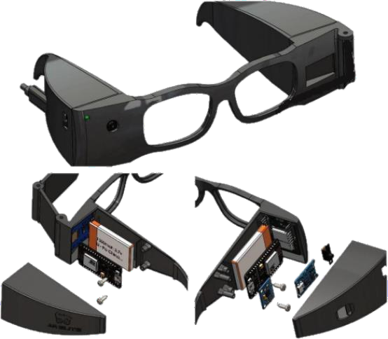
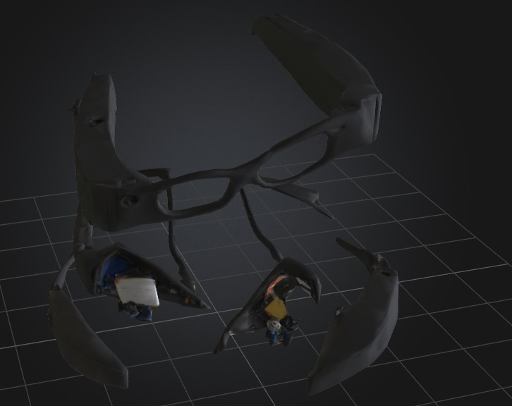
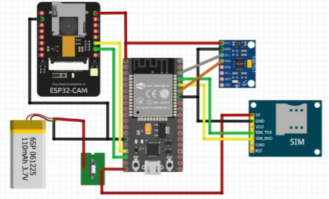
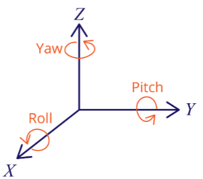
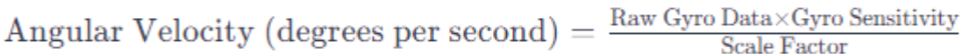
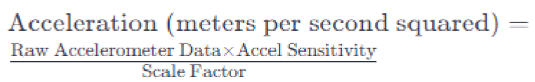
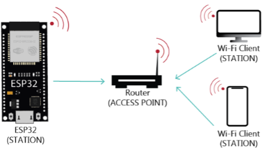

## Total Time Spent: 87 Hours

---

###  Day 1 - June 14  
**Time Spent:** 6h  
**Activities:**  
- Brainstormed idea of wearable robot frame  
- Researched embedded vision in small spaces  
- Explored use cases in fall detection robotics  

---

###  Day 2 - June 15  
**Time Spent:** 5h  
**Activities:**  
- Sketched initial HMD frame for ESP32-WROOM mounting  
- Compared ESP32-CAM and RPi Camera in size, power, and clarity  
- Drafted sensor dataflow (gyro → microcontroller → GSM)  

---

###  Day 3 - June 16  
**Time Spent:** 6h  
**Activities:**  
- Modeled frame in Fusion 360 with component cavities  
- Verified mounting stability of SIM800L  
- Simulated vision cone overlap with actual camera FOV  

---

###  Day 4 - June 17  
**Time Spent:** 4h  
**Activities:**  
- Found suppliers for high CRI glass and protective covers  
- Compared ABS vs PLA for head comfort and shock absorption  
- Refined ear-hook design for frame  

---

###  Day 5 - June 18  
**Time Spent:** 5h  
**Activities:**  
- Simulated fall angles using MPU6050 and threshold algorithms  
- Tested Bluetooth connectivity range between modules  
- Designed GSM alert conditions  

---

###  Day 6 - June 19  
**Time Spent:** 4h  
**Activities:**  
- Drafted logic diagram of entire HMD system  
- Searched low-latency serial adapters for camera uploads  
- Estimated frame weight distribution  

---

###  Day 7 - June 20  
**Time Spent:** 6h  
**Activities:**  
- Refined power flow diagram: battery → charger → ESP32  
- Simulated overcurrent protection in charging circuit  
- Documented average current draw during idle vs alert mode  

---

###  Day 8 - June 21  
**Time Spent:** 4h  
**Activities:**  
- Compared SMS latency in SIM800L on multiple carriers  
- Simulated random tilt events and alert performance  
- Added logging triggers to decision logic  

---

###  Day 9 - June 22  
**Time Spent:** 4h  
**Activities:**  
- Reviewed foam padding options for forehead and ear area  
- Simulated heat dissipation with ventilation gaps in the shell  
- Cleaned up wiring routes in CAD  

---

###  Day 10 - June 23  
**Time Spent:** 5h  
**Activities:**  
- Tested wiring breadboard layout virtually  
- Labeled all modules and points for real-world assembly  
- Calculated real battery life under vision load  

---

###  Day 11 - June 24  
**Time Spent:** 5h  
**Activities:**  
- Designed dashboard mockup for viewing tilt and image stats  
- Logged false positives in simulated fall conditions  
- Adjusted gyroscope sample rate for smoother results  

---

###  Day 12 - June 25  
**Time Spent:** 4h  
**Activities:**  
- Adjusted frame hole sizes for snug camera fit  
- Explored camera alignment with front glass curvature  
- Finalized code block sequence for boot-to-alert loop  

---

###  Day 13 - June 26  
**Time Spent:** 4h  
**Activities:**  
- Reviewed SIM800L power needs with GSM spikes  
- Tested relay control for emergency shutdown  
- Simulated "dead zones" in visual detection  

---

###  Day 14 - June 27  
**Time Spent:** 5h  
**Activities:**  
- Designed glass holder with vibration isolation  
- Simulated opponent tracking through various lighting conditions  
- Optimized camera shutter timing to reduce motion blur  

---

###  Day 15 - June 28  
**Time Spent:** 4h  
**Activities:**  
- Cleaned up simulation reports  
- Created image logs of vision tests  
- Documented fall scenarios and edge cases  

---

### Day 16 - June 29  
**Time Spent:** 5h  
**Activities:**  
- Modeled and rendered final headset design  
- Created documentation index for all parts  
- Edited journal entries for clarity  

---

###  Day 17 - June 30  
**Time Spent:** 5h  
**Activities:**  
- Built README.md and wiring illustrations  
- Labeled real PCB and added callouts  
- Captured final renders and angle views  

---

###  Day 18 - July 1  
**Time Spent:** 6h  
**Activities:**  
- Reviewed full submission checklist  
- Organized repo folders and file hierarchy  
- Finalized all documentation for submission  

---
## Images
-    
- 
- 
- 
- 
- 
- 
- 
- 