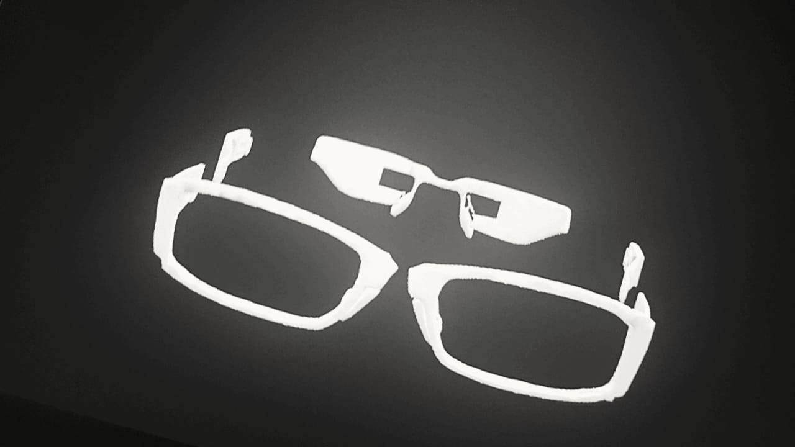
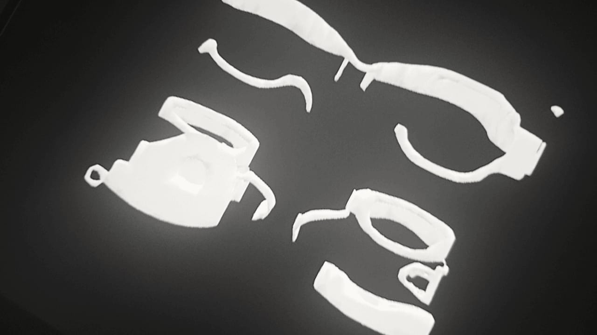
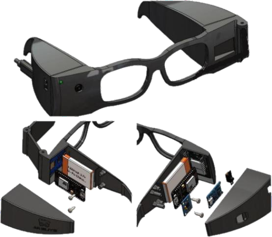
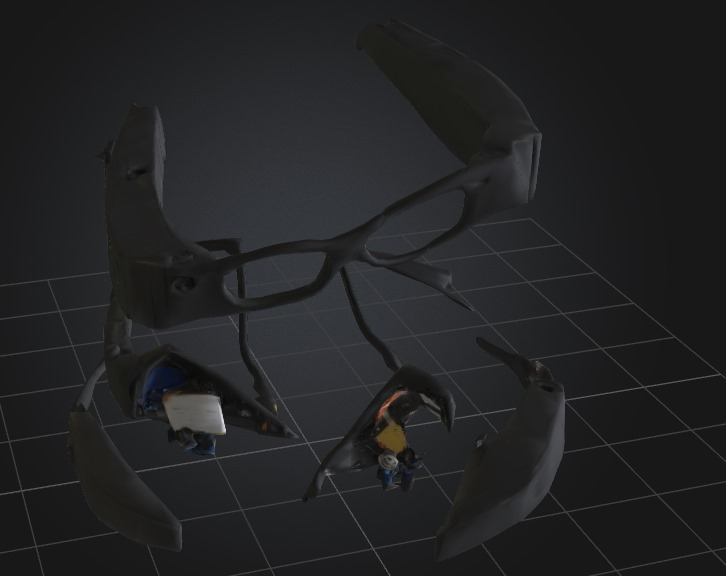

# HMD Glass: Head-Mounted Autonomous Battle Bot

## Description
HMD Glass is a wearable head-mounted robot designed for mini wrestling-style autonomous combat. It visually detects opponents, reacts with smart movement, and alerts when flipped, all inside a compact 3D-printed glasses frame.

## Why I Built It
Inspired by the fusion of robotics and wearables, I created this device to see the autonomous behavior in a constrained space. It's a testbed for visual recognition, feedback loops, and fall-alert systems, all packed into an HMD form factor that’s lightweight and functional.

## System Images
-    
- 
- 
- 
## Bill of Materials (BOM)

| Component                                | Quantity | Cost (USD) | Link                                                                                     |
|-----------------------------------------|----------|------------|------------------------------------------------------------------------------------------|
| Raspberry Pi Camera Module V3           | 1        | $55        | [RAM-E-Shop](https://www.ram-e-shop.com/ar/shop/rpi-v3-camera-raspberry-pi-camera-module-v3-official-12-mp-and-autofocus-imx708-official-8737) |
| ESP32-WROOM Board                       | 1        | $42        | [RAM-E-Shop](https://www.ram-e-shop.com/ar/shop/raspberry-pi-zero-2w-raspberry-pi-zero-2-w-9256) |
| MPU6050 Gyroscope & Accelerometer       | 1        | $6         | -                                                                                        |
| SIM800L GSM Module (with antenna)       | 1        | $12        | [Amazon](https://www.amazon.com/SIM800L-Wireless-Extension-Antenna-Replacement/dp/B09BMQ3JDV) |
| 18650 Lithium Battery Pack + Charger    | 1        | $40        | -                                                                                        |
| Power Switch & JST Connectors           | 1        | $12        | -                                                                                        |
| 3D-Printed Glasses Frame (ABS)          | 1        | $25        | -                                                                                        |
| Jumper Wires & Breadboard               | 1        | $18        | -                                                                                        |
| USB to Serial Adapter                   | 1        | $13        | -                                                                                        |
| Enclosure Foam Padding & Mounting Gear  | 1        | $9         | -                                                                                        |
| High Quality Glass for HMD Front Panel  | 1        | $22        | -                                                                                        |

**Total: $254**

